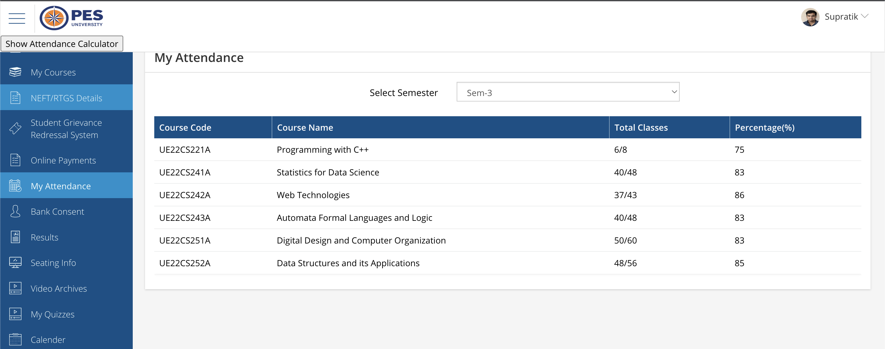
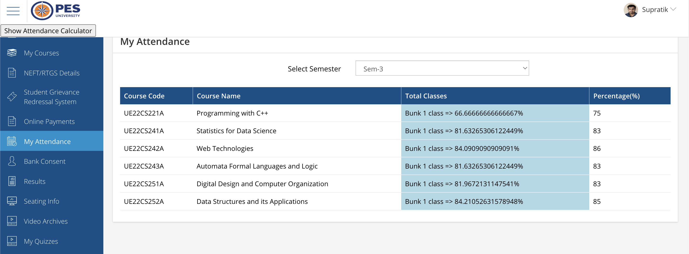

# PESUcademy Attendance Calculator

Welcome to the PESUcademy Attendance Calculator repository! This web extension is designed to enhance your experience with the PESUcademy attendance portal by providing you with useful information about your attendance, such as how it will be affected if you decide to skip a class.

## Table of Contents

- [Introduction](#introduction)
- [Features](#features)
- [Installation](#installation)
- [Usage](#usage)
- [Contribution](#contribution)
- [License](#license)

## Introduction

Are you a student at PES University who often wonders how your attendance percentage would change if you miss a lecture? This web extension is here to help! With a simple click of a button, it augments your PESUcademy attendance page, providing insights into the impact of your attendance choices.

## Features

- **Attendance Prediction:** With just a single click, you can view how your attendance percentage will change if you decide to skip a particular class. This helps you make informed decisions about whether to attend or not.

- **Enhanced User Interface:** The extension seamlessly integrates with the PESUcademy website, providing a user-friendly interface that doesn't disrupt your browsing experience.

- **Customization:** This extension is designed to be customizable. You can tweak the settings to tailor it to your specific needs.

## Installation

To start using the PESUcademy Attendance Calculator, follow these simple installation steps:

1. Open Google Chrome.

2. Type `chrome://extensions/` in the address bar and press Enter.

3. Enable the "Developer mode" switch located in the top right corner of the extensions page.

4. Click on the "Load unpacked" button.

5. Select the local copy of this repository that is stored on your computer.

That's it! The extension is now installed and ready to use.

## Usage

Using the PESUcademy Attendance Calculator is straightforward:

1. Navigate to the PESUcademy attendance page in your browser.

2. In the top left corner, you'll find the ‘show attendance calculator’ button. Click on it to activate the extension.

3. Once activated, you'll see additional information on the page, including attendance predictions.



## Contribution

We welcome contributions from the open-source community. If you want to improve this extension or fix issues, please follow these steps:

1. Fork this repository.

2. Make your changes.

3. Submit a pull request.

We will review your contributions and merge them if they align with the project's goals.

## License

This project is licensed under the [MIT License](LICENSE). Feel free to use, modify, and distribute it according to the terms of the license.

Enjoy using the PESUcademy Attendance Calculator and make informed attendance decisions for a successful academic journey! If you encounter any issues or have suggestions, please don't hesitate to create an issue or submit a pull request. We appreciate your feedback and support.